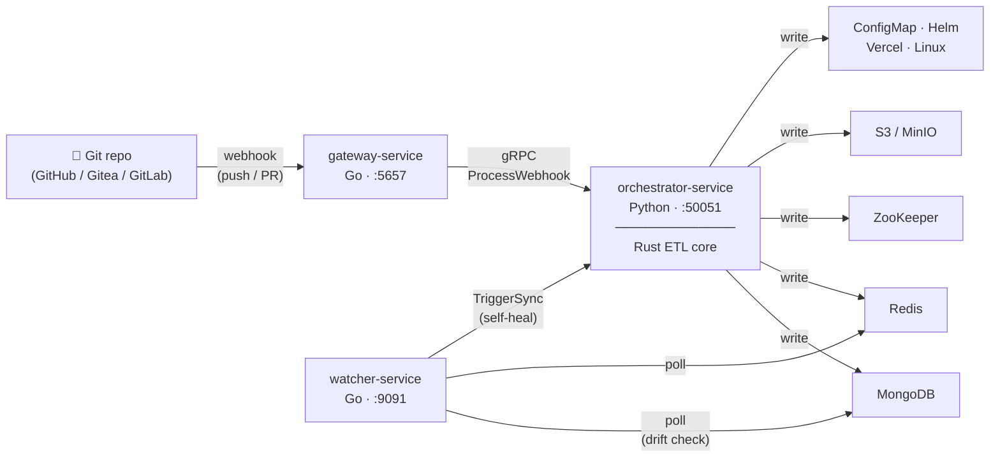

# varTrack

**GitOps-native configuration sync.** Push a file to Git — varTrack writes it to your datastores automatically.

[](https://github.com/jarin-devoss/varTrack/actions/workflows/ci.yml)
[](https://github.com/jarin-devoss/varTrack/blob/main/LICENSE)
[](https://hub.docker.com/u/jarin-devoss)

---

## What it does

You commit a config file. varTrack syncs it everywhere.

```yaml
# configs/app.yaml — lives in your Git repo
database_host: mongo.prod.internal
feature_flag_dark_mode: true
max_connections: 50
```

Push to `main` → varTrack automatically writes these values to every configured sink:

```
MongoDB     →  collection "production-config"
Redis       →  hash       "production:cfg"
ZooKeeper   →  znodes     /acme/production/
S3          →  key prefix acme/production/
```

If someone edits MongoDB directly and changes `max_connections` to `5`, the watcher detects it and restores `50` automatically — no manual intervention needed.

---

## Why varTrack?

Tools like **ArgoCD** and **FluxCD** are excellent at deploying *Kubernetes manifests* from Git. They don't solve a different problem: syncing runtime configuration values into the datastores your applications actually read — MongoDB documents, Redis hashes, ZooKeeper znodes, S3 objects, Linux `.env` files.

varTrack fills that gap. It treats Git as the single source of truth for **application configuration data** — not Kubernetes resources.

| | ArgoCD / FluxCD | varTrack |
|---|---|---|
| Target | Kubernetes manifests | MongoDB, Redis, ZooKeeper, S3, ConfigMap, Helm, Vercel, Linux |
| Trigger | Git push | Git push / webhook |
| Drift detection | Kubernetes state | Any datasource |
| Secret management | Kubernetes secrets | HashiCorp Vault integration |
| Schema validation | None | CUE schema per tenant |

They complement each other: use ArgoCD to deploy your services, use varTrack to keep their runtime config in sync.

---

## Key features

<div class="grid cards" markdown>

-   :material-database-sync:{ .lg .middle } **8 sink types**

    ---

    MongoDB, Redis, ZooKeeper, S3, Kubernetes ConfigMap, Helm, Vercel, Linux server (SSH)

    [:octicons-arrow-right-24: See all sinks](sinks/index.md)

-   :material-shield-lock:{ .lg .middle } **Secret management**

    ---

    `@secret()` annotations pull values from HashiCorp Vault at ETL time. Secrets never touch Git. Dry-run reports mask them as `***`

    [:octicons-arrow-right-24: Schema annotations](configuration/annotations.md)

-   :material-check-decagram:{ .lg .middle } **CUE schema validation**

    ---

    Every push is validated against a per-tenant CUE schema before any write. Invalid configs are rejected with a detailed error — zero bad writes

    [:octicons-arrow-right-24: Schema annotations](configuration/annotations.md)

-   :material-radar:{ .lg .middle } **Drift detection**

    ---

    Watcher polls each datasource and compares against the Git baseline. On drift, logs the delta and optionally restores correct state — automatically

    [:octicons-arrow-right-24: How drift detection works](concepts/drift-detection.md)

-   :material-swap-horizontal:{ .lg .middle } **Multi-sink fan-out**

    ---

    One push writes to multiple sinks in parallel. One rule set for all environments

    [:octicons-arrow-right-24: Destination template](concepts/destination-template.md)

-   :material-source-branch:{ .lg .middle } **Any config format**

    ---

    YAML, JSON, TOML, .env, INI, HCL, XML — format auto-detected from file extension

    [:octicons-arrow-right-24: Supported formats](configuration/formats.md)

-   :material-console:{ .lg .middle } **CLI — `vt`**

    ---

    Push any local file from terminal or CI/CD. Validate against schemas. Inspect tasks

    [:octicons-arrow-right-24: CLI reference](cli/index.md)

-   :material-eye-check:{ .lg .middle } **Dry-run mode**

    ---

    Simulate any sync and see exactly what would be written — without touching a datasource. Secret fields masked as `***`

    [:octicons-arrow-right-24: Dry-run reference](concepts/sync-strategies.md#dry-run)

</div>

---

## Try it in one command

The fastest way to see varTrack in action is the end-to-end demo. It starts a local Git server, MongoDB, ZooKeeper, Redis, and all three varTrack services:

```bash
cd e2e
docker compose up
```

Push a config change to the local repo and watch it sync automatically.

---

## How it works



1. You push a config file.
2. **gateway-service** (Go) receives the webhook, verifies the HMAC signature, and forwards it via gRPC.
3. **orchestrator-service** (Python) fetches the file from Git, validates it against a CUE schema, runs the Rust ETL core (diff, merge, prune), and writes to all configured sinks.
4. **watcher-service** (Go) polls datasources on a configurable interval. On drift, it logs the delta and — if `self_heal: true` — calls the orchestrator to restore correct state.

!!! info "Why Rust inside the orchestrator?"
    The ETL core (diff, flatten, merge, prune) is implemented in Rust and called from Python via FFI. This keeps the hot path allocation-free and handles multi-megabyte config payloads without GC pressure, while the Python layer handles I/O, Vault, and sink drivers.

[:octicons-arrow-right-24: Full architecture overview](concepts/index.md)
